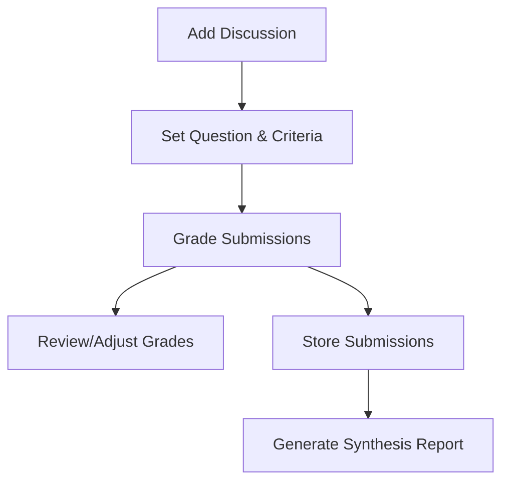

# Product Context: Multi-Discussion Grading System

## Problems This Project Solves

### 1. Manual Grading Inefficiency

Without automation, TAs spend excessive time manually reading, evaluating, and providing feedback on student discussion posts. For a class with 30 students and 10 discussions per semester, this results in grading 300 submissions manually - a significant time burden.

### 2. Inconsistent Grading

Manual grading across multiple TAs or even by the same TA at different times can lead to inconsistent evaluation standards. This creates unfairness in the grading process and confusion for students.

### 3. Limited Feedback Quality

TAs under time pressure may provide minimal or generic feedback, reducing the educational value of discussions. Students benefit from detailed, personalized feedback that addresses specific aspects of their submissions.

### 4. Difficulty Tracking Multiple Discussions

Managing numerous discussion topics throughout a semester becomes increasingly complex without proper organization. This can lead to lost submissions, delayed grading, or confusion about which criteria apply to which discussion.

### 5. Inability to Synthesize Student Insights

Instructors lack tools to efficiently extract and combine valuable insights from student discussions. The collective knowledge and perspectives in student submissions often remain untapped due to the difficulty of manual synthesis.

## How The System Should Work

### 1. Streamlined Workflow

The system should provide a clear, linear workflow that guides TAs through the process of creating, managing, and grading discussions.

### 2. Intelligent Assistance

The system should leverage AI to:
- Evaluate submissions based on specified criteria
- Generate constructive, personalized feedback
- Identify key themes and insights across submissions
- Suggest improvements to student work

### 3. Flexible Management

TAs should be able to:
- Create multiple discussions with unique questions and criteria
- Update discussion parameters as needed
- Organize discussions by topic, date, or other relevant factors
- Access all submissions and grades in a structured manner

### 4. Knowledge Synthesis

The system should:
- Combine insights from multiple student submissions
- Generate "crowd-sourced" summaries that capture diverse perspectives
- Filter submissions by quality to focus on the most valuable contributions
- Provide instructors with synthesized content they can use for class discussions

## User Experience Goals

### For Teaching Assistants

1. **Efficiency**: Reduce grading time by at least 50% compared to manual methods
2. **Confidence**: Provide consistent grading that TAs can trust and defend
3. **Organization**: Keep all discussions, submissions, and grades in one structured system
4. **Flexibility**: Allow customization of grading criteria and feedback style
5. **Transparency**: Make the grading process clear and explainable

### For Instructors

1. **Oversight**: Easily review grading patterns and ensure consistency
2. **Insight**: Extract valuable perspectives from student discussions
3. **Engagement**: Identify discussion topics that generate the most thoughtful responses
4. **Improvement**: Track discussion quality trends over time

## Success Scenarios

### Scenario 1: Weekly Discussion Grading

A TA creates a new discussion with specific criteria, then efficiently grades 30 student submissions using the batch grading feature. The system automatically saves all submissions, provides consistent grading, and generates personalized feedback that the TA can review and adjust before finalizing. The entire process takes 45 minutes instead of 3+ hours with manual methods.

### Scenario 2: Mid-Semester Insight Generation

An instructor wants to understand student perspectives on a complex topic discussed over several weeks. They use the synthesis feature to generate a comprehensive summary of high-quality student submissions, filtered to include only those that received grades of 8/12 or higher. This synthesis reveals patterns and insights that inform future lecture content.

### Scenario 3: End-of-Semester Review

A TA needs to review a student's progression throughout the course. The system allows quick access to all of that student's discussion submissions and grades in one place, making it easy to identify trends and improvements over time.
