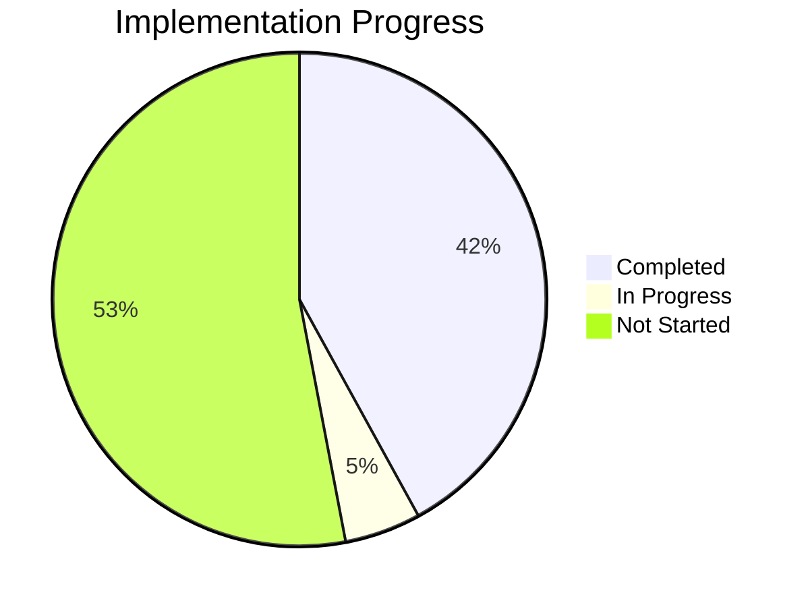

# Project Progress: Multi-Discussion Grading System

## Current Status

**Project Phase**: Implementation - Phase 1

**Overall Progress**: 42%

## What Works

1. **Project Planning**
   - ✅ System architecture design
   - ✅ Technology stack decisions
   - ✅ Implementation strategy defined
   - ✅ Memory bank documentation structure

2. **Initial Setup**
   - ✅ Project repository cleanup
   - ✅ Core files identification
   - ✅ Initial requirements analysis

3. **Base Functionality Available**
   - ✅ Single discussion grading logic (from original system)
   - ✅ Basic AI integration for grading (from original system)

4. **Project Structure (Step 1.1 Complete)**
   - ✅ Created directory hierarchy
   - ✅ Set up configuration system with config.json
   - ✅ Defined package structure
   - ✅ Implemented basic framework code for config and AI

5. **Library Layer Foundation**
   - ✅ Discussion Manager implementation (Step 1.2 Complete)
     - ✅ Discussion creation and storage
     - ✅ Discussion retrieval and listing
     - ✅ Discussion update functionality
     - ✅ File storage and metadata handling
   - ✅ AI Integration implementation (Step 1.3 Complete)
     - ✅ AIGrader class with error handling and JSON parsing
     - ✅ Data models for GradingCriteria and GradedSubmissions
     - ✅ Comprehensive unit tests with mocked responses
     - ✅ Adaptable prompts for different discussion types
   - 🔄 Basic configuration management

6. **Controller Layer Foundation**
   - ✅ Discussion Controller implementation (Step 1.4 Complete)
     - ✅ Controller methods for creating, listing, showing, and updating discussions
     - ✅ Multiple output formats (text, table, JSON, CSV)
     - ✅ Integration with Click commands in the CLI
     - ✅ Comprehensive unit tests with mocked library layer

## What's In Progress

1. **Documentation**
   - 🔄 Testing strategy finalization

2. **CLI Framework**
   - ✅ CLI Framework Setup (Step 1.5 Complete)

## What's Left to Build

### Phase 1: Core Architecture (42% Complete)

1. **Library Layer Foundation**
   - ❌ Submission Grader implementation

2. **Controller Layer**
   - ✅ Discussion Controller
   - ❌ Submission Controller
   - ✅ Base Controller functionality

3. **CLI Framework**
   - ✅ Basic Click setup in grader.py
   - ✅ Complete command implementation (Step 1.5 Complete)
   - ✅ Help text and documentation

4. **Testing Framework**
   - ✅ Initial library layer tests for Discussion Manager
   - ✅ Controller layer tests
   - ❌ Integration tests

### Phase 2: Enhanced Grading (33% Complete)

1. **Submission Storage**
   - ✅ Submission saving during grading (Step 2.1 Complete)
   - ✅ Metadata tracking for submissions
   - ✅ Submission organization by discussion

2. **Batch Grading**
   - ❌ Interactive grading interface
   - ❌ Submission management in batches
   - ❌ Progress tracking during batch grading

3. **Clipboard Integration**
   - ❌ Copy grade reports to clipboard
   - ❌ Format adaptation for clipboard
   - ❌ Cross-platform clipboard support

### Phase 3: Synthesis & Reporting (0% Complete)

1. **Submission Collection**
   - ❌ Filtering mechanisms (by grade, criteria)
   - ❌ Submission loading for analysis
   - ❌ Metadata aggregation

2. **AI-Powered Synthesis**
   - ❌ Configurable synthesis prompts
   - ❌ Chunking for large submission sets
   - ❌ Result formatting options

3. **Output Formats**
   - ❌ Text, JSON, CSV output formats
   - ❌ Format-specific rendering
   - ❌ Clipboard integration for outputs

## Evolution of Project Decisions

### Initial Concept to Current Plan

1. **Original System Focus**:
   - Single discussion grading
   - Basic AI integration
   - Simple command-line interface
   - No submission storage

2. **Expanded Vision**:
   - Multi-discussion management
   - Comprehensive storage system
   - Advanced CLI with noun-verb pattern
   - Synthesis capabilities for instructors

3. **Architectural Evolution**:
   - From single-file scripts to layered architecture
   - From ad-hoc functions to organized modules
   - From basic argparse to Click framework
   - From minimal storage to structured filesystem

### Technology Decisions

1. **CLI Framework**:
   - Initial plan: Basic argparse
   - Final decision: Click for better command organization
   - Reasoning: Better support for complex command hierarchies

2. **Storage Mechanism**:
   - Initial plan: Simple file output
   - Final decision: Structured filesystem with JSON metadata
   - Reasoning: Balance of simplicity and organization without database complexity

3. **Testing Approach**:
   - Initial plan: Basic unit tests
   - Final decision: Comprehensive testing with pytest
   - Reasoning: Better maintainability and confidence in changes

4. **Dependency Versioning**:
   - Decision: Use ">=" syntax for version requirements
   - Reasoning: Ensures minimum tested versions while allowing compatibility with newer versions

## Known Issues & Limitations

1. **API Dependency**:
   - System requires Anthropic API key
   - Subject to API rate limits and costs
   - May face issues with very large submission volumes

2. **Performance Considerations**:
   - Grading is inherently synchronous due to API interaction
   - Large batches may take significant time to process
   - Synthesis of many submissions faces token limitations

3. **Cross-Platform Considerations**:
   - Clipboard functionality varies by operating system
   - File path handling differences between OS platforms
   - Terminal UI limitations in different environments
