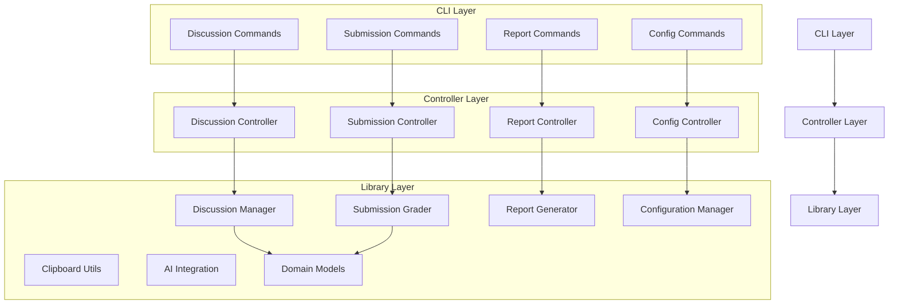
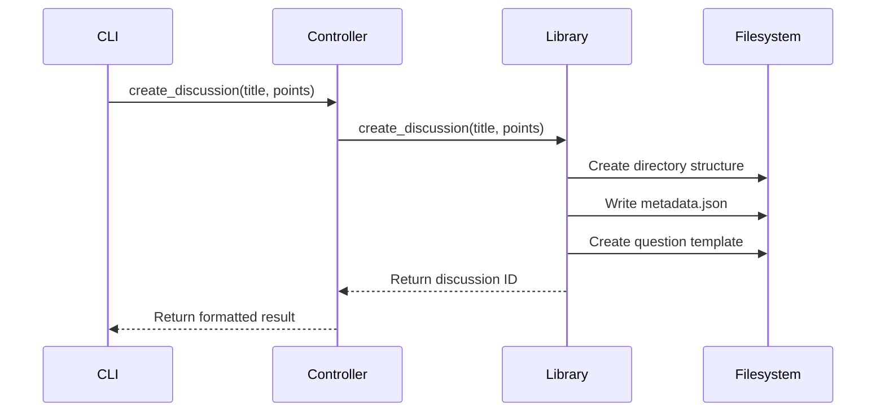
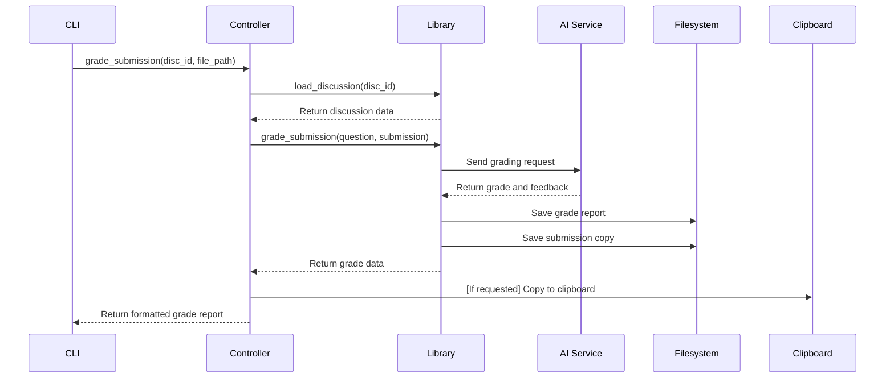
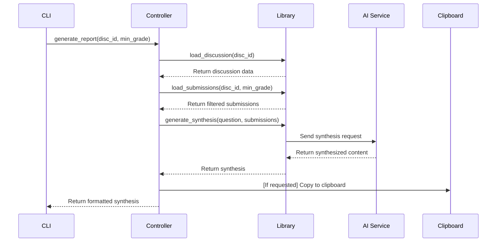
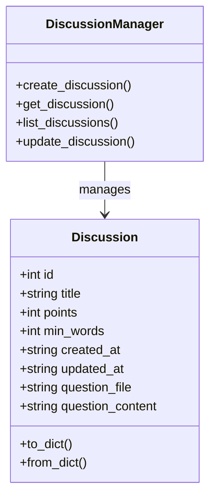

# System Patterns: Multi-Discussion Grading System

## System Architecture

We are implementing a clean, layered architecture that separates concerns and promotes testability and maintainability.



### 1. CLI Layer (Presentation)
- Handles command-line parsing and user interaction
- Built with Click framework
- Follows noun-verb command pattern
- Responsible for formatting output for user consumption
- Passes commands to the Controller layer

### 2. Controller Layer (Application)
- Acts as a bridge between CLI and Library layers
- Transforms CLI options to library parameters
- Handles formatting and presentation logic
- Orchestrates calls to multiple library components when needed
- Not concerned with business logic details

### 3. Library Layer (Domain)
- Contains core business logic
- Independent of UI concerns
- Provides services for discussion management, grading, reporting
- Can be reused in different contexts (e.g., future GUI or API)
- Includes domain models that represent business entities

## Key Technical Decisions

### 1. Command Line Interface

We've adopted the **noun-verb pattern** for our CLI, which follows modern conventions for command-line tools:

```
grader <noun> <verb> [options] [arguments]
```

Examples:
- `grader discussion create --title "Week 1 Discussion"`
- `grader submission grade 3 student1.md --clipboard`
- `grader report generate 3 --min-grade=8`

We're using **Click** as our CLI framework because it provides:
- Intuitive decorator-based command definition
- Built-in help generation
- Nested command support
- Strong type validation
- Context object for sharing state between commands

### 2. File Organization

```
discussion-grader/
├── grader.py                # Main CLI entry point
├── config/                  # Configuration files
├── discussions/             # Discussion data storage
├── lib/                     # Library layer
├── controllers/             # Controller layer
└── tests/                   # Test suite
```

### 3. Dependency Management

- **Direct Injection**: We pass dependencies directly to classes and functions rather than using global state
- **Composition Over Inheritance**: We compose functionality through object composition rather than deep inheritance hierarchies

### 4. Error Handling

- **Layered Error Handling**: Each layer handles errors appropriate to its level of abstraction
- **CLI Layer**: User-friendly error messages
- **Controller Layer**: Transforms domain exceptions to user-appropriate messages
- **Library Layer**: Domain-specific exceptions

### 5. Domain Models

- **Rich Domain Objects**: Using Python dataclasses to create rich domain models rather than plain dictionaries
- **Serialization Methods**: Models include to_dict() and from_dict() methods for storage and retrieval
- **Type Safety**: Leveraging Python type hints for better code safety and IDE assistance
- **Default Values**: Models include sensible defaults to simplify object creation

## Design Patterns

### 1. Command Pattern
The noun-verb CLI structure essentially implements the command pattern, where each command encapsulates all the information needed to perform an action.

### 2. Controller Pattern
The controllers act as intermediaries between the CLI and library layers, handling the transformation of CLI input to domain operations.

### 3. Repository Pattern
The Discussion Manager and Submission Grader implement the repository pattern for storing and retrieving discussions and submissions.

### 4. Facade Pattern
Each major library component provides a simplified interface to a more complex subsystem (e.g., AI Grader encapsulates all the complexity of interacting with the Claude API).

### 5. Strategy Pattern
Different formatting strategies (table, JSON, CSV) can be selected at runtime.

### 6. Domain Model Pattern
We use rich domain models (e.g., Discussion class) that encapsulate both data and behavior, following Domain-Driven Design principles.

## Critical Implementation Paths

### 1. Discussion Management Flow



### 2. Grading Flow



### 3. Synthesis Flow



## Domain Models

### Discussion Model



The Discussion model serves as the primary domain entity for discussion-related data:
- Implemented as a Python dataclass for clean, type-safe code
- Contains all discussion metadata (ID, title, points, etc.)
- Includes methods for serialization to/from dictionaries
- Used by the DiscussionManager for CRUD operations
- Provides a clear contract between layers of the application
